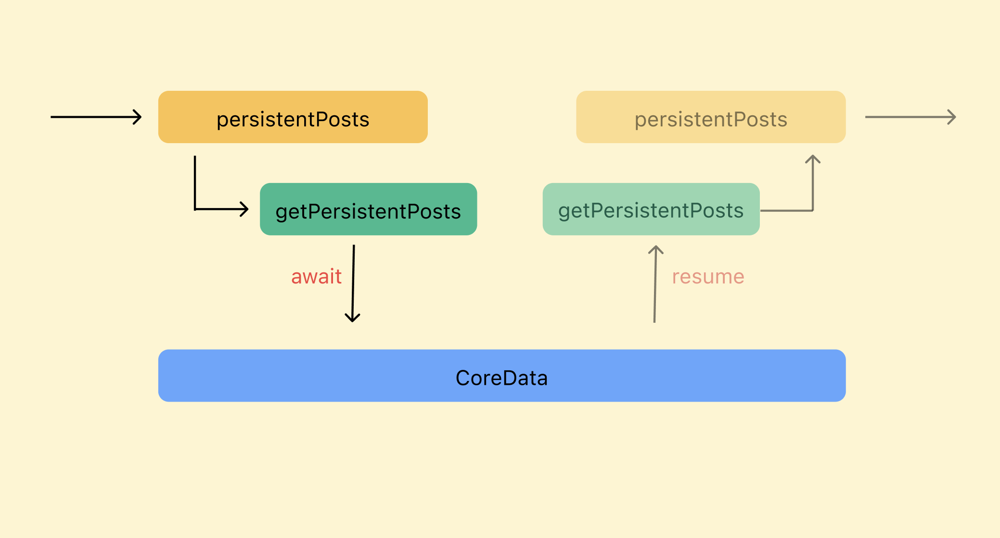
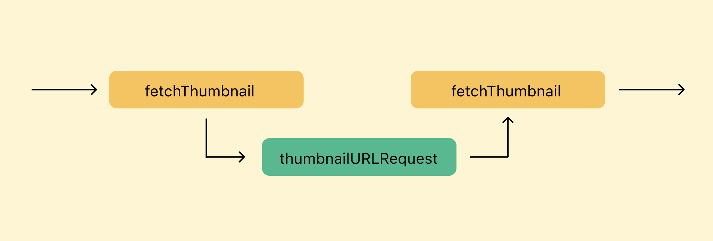
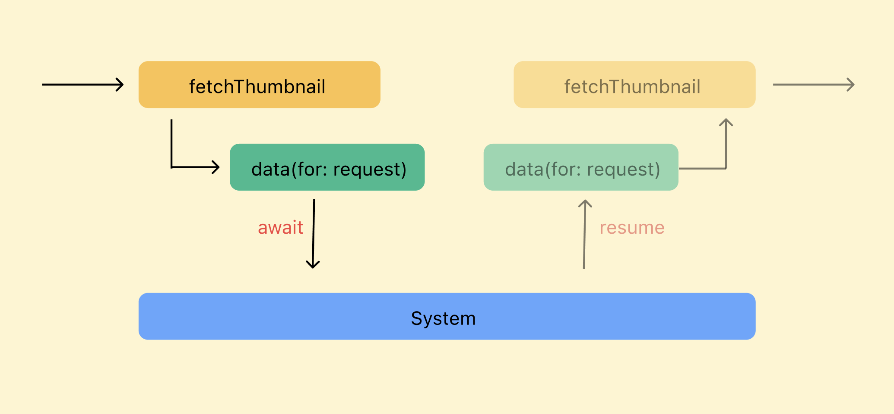

# Async/Await

<aside>
💡 `CompletionHandler`를 사용하여 비동기 처리를 하면, `@escaping` 클로저를 연속적으로 사용해야 하는 경우가 있다.
ex) 이미지를 Data로 다운로드한 뒤 해당 데이터로 UIImage를 생성하는 동작.
순차적인 처리를 위해 클로저가 여러개 중첩되는 경우, 가독성에 상당히 나빠진다.
이런 문제는 **Async/Await**를 사용해서 해결이 가능하다!

</aside>

## CompletionHandler

- Async/Await가 등장하기 전에 클로저를 주입받아서 비동기 처리를 수행하는 방식이다.

### 한계

- github 저장소를 검색한 후 결과값을 print후 language에 따른 color 데이터를 다시 요청하는 동작을 수행한다.
- escaping 클로저가 중첩되며 가독성이 낮은 코드가 작성된다.

```swift
self.search(with: .init(name: "swift")) { result in
    switch result {
    case .success(let repositories):
        print(repositories)
        self.getLangColor { result in
            switch result {
            case .success(let colors):
                print(colors)
            case .failure(let error):
                print(error)
            }
        }
    case .failure(let error):
        print(error)
    }
}

private func search(
    with option: SearchOption,
    completion: @escaping (Result<Repositories, NetworkError>) -> Void) {
        self.networkService.request(endPoint: .search(option: option), completion: completion)
}

private func getLangColor(
    completion: @escaping (Result<LanguageColors, NetworkError>) -> Void) {
        self.networkService.request(endPoint: .langColor, completion: completion)
}
```

## Async/Await 으로 CompletionHandler를 대체

```swift
let repositories: Repositories = try await self.networkService.request(endPoint: .search(option: .init(name: "swift")))
let langColors: LanguageColors = try await self.networkService.request(endPoint: .langColor)

public func request<T: Decodable>(endPoint: EndPoint) async throws -> T {
    guard let request = endPoint.request else {
        throw NetworkError.emptyRequest
    }
    
    var resultData: Data
    
    if let data = cache.cachedResponse(for: request)?.data {
        resultData = data
    } else {
        resultData = try await data(for: request)
    }
    
    let decodedData = try JSONDecoder().decode(T.self, from: resultData)
    
    return decodedData
}

private func data(for request: URLRequest) async throws -> Data {
    let (data, response) = try await session.data(for: request)
    
    guard isValid(response: response) else {
        throw NetworkError.invalidRequest
    }
    
    let cachedData = CachedURLResponse(response: response, data: data)
    
    cache.storeCachedResponse(cachedData, for: request)
    
    return data
}
```

- async/await 사용으로 가독성이 좋아졌다!

### Continuation

- 동기식 코드와 비동기식 코드간의 인터페이스를 위한 매커니즘
- async함수를 수동제어 함.



```swift
func persistentPosts() async throws -> [Post] {
    typealias PostContinuation = CheckedContinuation<[Post], Error>
    return try await withCheckedThrowingContinuation { (continuation: PostContinuation) in
        
        // 기존 CompletionHandler를 활용한 함수.
        self.getPersistentPosts { posts, error in
            if let error = error {
                continuation.resume(throwing: error)
            } else {
                continuation.resume(returning: posts)
            }
        }
    }
}
```

- `resume`은 한 번만 실행되어야 한다.

## Thread

### Sync



sync context에서 스레드 제어권 흐름

- sync context에서는 함수가 호출되면 스레드 제어권을 가져오고, 실행이 끝나면 상위 함수에게 다시 제어권을 반환한다.
- Thread block이 일어난다.

### Async



async context에서 스레드 제어권 흐름

- Suspending
    - `await`시 스레드 제어권을 상위함수가 아닌 시스템에게 넘기는 방식으로 스레드 제어권을 포기하는 방식.
    - Suspending이 되고나면 시스템은 해당 스레드에 다른 작업을 실행할 수 있다.
    - Thread unblock
- Resume이 되면 suspend가 끝나고 다시 상위 함수로 돌아온다.
