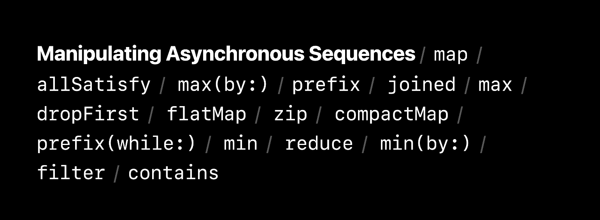

# AsyncSequence

<aside>
💡 기존의 Iteration을 가능하게 하는 Sequence 프로토콜에 Async 성격이 추가된 프로토콜이다. 즉, Async task에 대한 반환값에 Sequence 형식으로 접근할 수 있도록하는 프로토콜이다.

</aside>

## 코드 예시

### AsyncSequence 타입 예시

```swift
for await value in some AsyncSequnce { }
```

- `value`는 Async하게 받아오므로 값이 있을수도 있고, 없을수도 있다. 그러므로 `await` 키워드를 사용한다.

### Throwable AsyncSequence

```swift
do {
    for try await value in some AsyncSequnce { }
} catch {
    // error handling.
}
```

- AsyncSequence가 Throwable한 요소들로 구성된 경우 `try`키워드를 붙여서 사용한다.

### AsyncSequence에 대한 WWDC 예시

```swift
class QuakeMonitor {
    var quakeHandler: (Quake) -> Void
    func startMonitoring()
    func stopMonitoring()
}

let monitor = QuakeMonitor()
monitor.quakeHandler = { quake in
    // ...
}

monitor.startMonitoring()

monitor.stopMonitoring()

/****************** async로 변환 *****************/

let quakes = AsyncStream(Quake.self) { continuation in
    let monitor = QuakeMonitor()
    monitor.quakeHandler = { quake in
        continuation.yield(quake)
    }

    continuation.onTermination = { _ in
        monitor.stopMonitoring()
    }

    monitor.startMonitoring()
}
```

- `AsyncStream`은 AsyncSequence를 생성하는 인터페이스다.
- Continuation으로 AsyncSequence 객체를 수동으로 제어하는 방식으로 구현됐다.
- Throwable한 `AsyncThrowingStream`도 있으며, 해당 객체를 사용하는 곳에서는 `try`를 붙여줘야 한다.

## AsyncSequence Operator

- Sequence에서 사용되는 Operator들을 AsyncSequence에서도 동일하게 사용할 수 있다.


