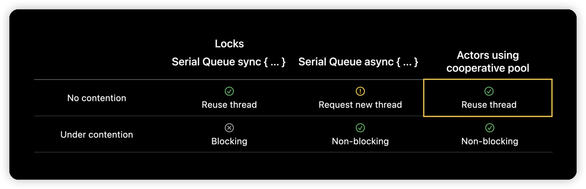

# Swift Concurrency

- [Async/Await](AsyncAwait.md)
- [AsyncSequence](AsyncSequence.md)

## Swift Concurrency의 등장 배경

### GCD(Grand Central Dispatch)

- iOS, macOS, watchOS, tvOS등에서 동시성 실행을 제공하는 프로그래밍 언어적 요소, 런타임 라이브러리 등이다.
- GCD의 개념으로 동시성 프로그래밍을 제공하는 API가 `DispatchQueue`이다.

### GCD의 한계

- Thread Explosion
    - Thread가 과도하게 많이 만들어지며 context switching이 너무 자주 일어나는 문제가 발생할 수 있다.
    ex) 1개의 코어에서 100개의 thread가 생성되면, 최소 100회의 context switching이 일어난다.
    - context switching은 오버헤드를 발생시켜 성능 저하의 원인이 된다.

### Swift Concurrency로 극복

- Swift Concurrency는 단일 thread에서 동작한다. 즉, 하나의 코어가 하나의 thread를 실행하도록 보장한다.
- `await`으로 중단됐을 때, CPU가 컨텍스트 스위칭을 해서 다른 스레드를 불러오는 것이 아니라 같은 스레드에서 다음 함수를 실행시킨다.

