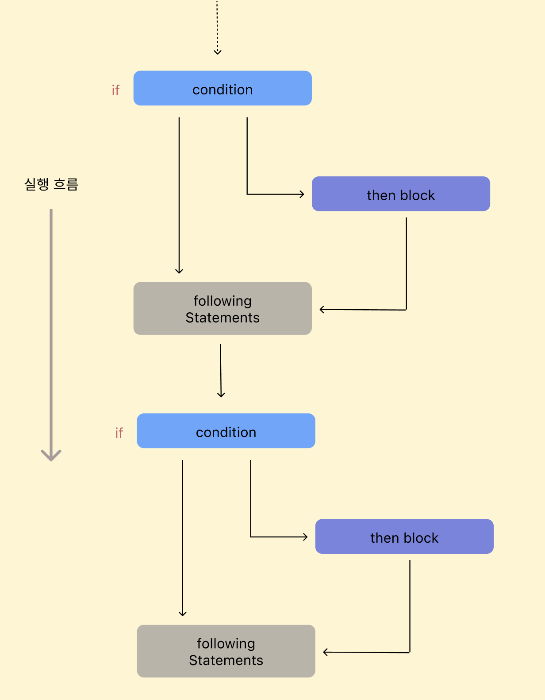
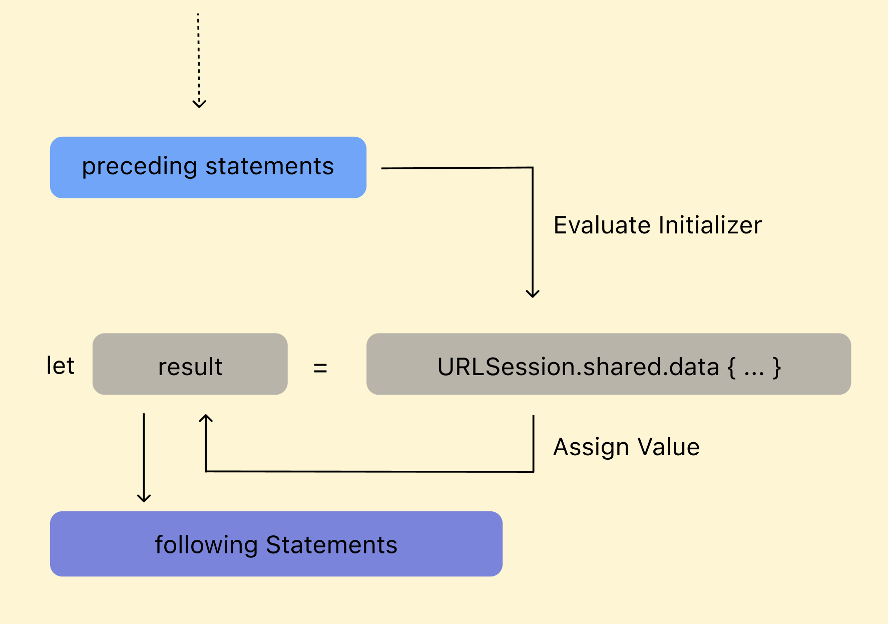
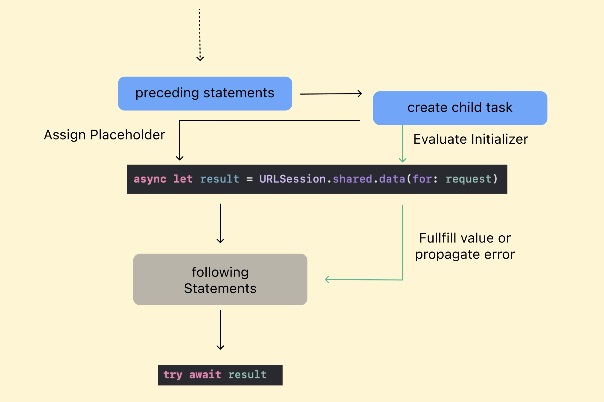
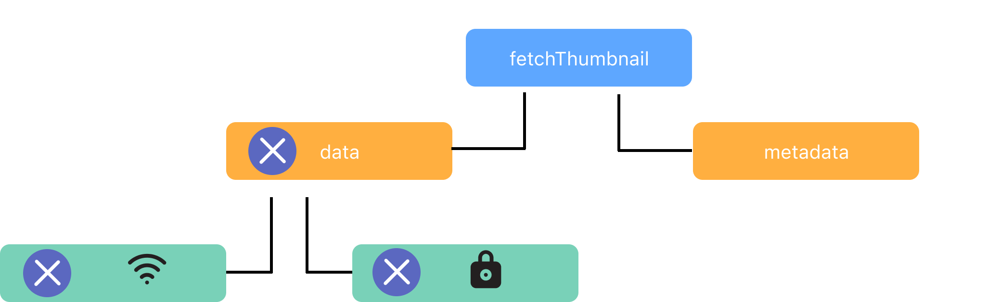

# Structured Concurrency

## 구조적 프로그래밍



- 절차적 프로그래밍의 하위 개념이다.
- `GOTO`문을 없애거나 의존성을 줄여준다. → 실행의 흐름을 위에서 아래로 흐르게 만든다.(자연스러움)

### CompletionHandler

```swift
public func request<T: Decodable>(
    endPoint: EndPoint,
    completion: @escaping (Result<T, NetworkError>) -> Void
) {
    func decodedResult(with data: Data) -> Result<T, NetworkError> {
        do {
            let decodedData = try JSONDecoder().decode(T.self, from: data)
            return .success(decodedData)
        } catch {
            return .failure(.unknown(error: error))
        }
    }
    
    guard let request = endPoint.request else {
        return completion(.failure(.emptyRequest))
    }
    
    let decoder = JSONDecoder()
    
    if let data = cache.cachedResponse(for: request)?.data {
        completion(decodedResult(with: data))
    } else {
        session.dataTask(with: request) { [weak self] data, response, error in
            guard let self = self,
                  self.isValid(response: response),
                  let data = data, let response = response else {
                completion(.failure(.invalidRequest))
                return
            }
            
            let cachedData = CachedURLResponse(response: response, data: data)
            
            self.cache.storeCachedResponse(cachedData, for: request)
            
            completion(decodedResult(with: data))
        }
        .resume()
    }
}
```

- 위 함수는 request의 결과를 반환하지 않고, 전달받은 completionHandler에 결과값을 전달한다.
즉, Handler의 작업이 함수 내에서 수행되는 것이 아니라 외부에서 수행된다.
- 위에서 아래로 읽는 **구조화된 프로그래밍** 방식이 아니다.

### Async/Await

```swift
public func request<T: Decodable>(endPoint: EndPoint) async throws -> T {
    guard let request = endPoint.request else {
        throw NetworkError.emptyRequest
    }
    
    var resultData: Data
    
    if let data = cache.cachedResponse(for: request)?.data {
        resultData = data
    } else {
        resultData = try await data(for: request)
    }
    
    let decodedData = try JSONDecoder().decode(T.self, from: resultData)
    
    return decodedData
}
```

- async/await 사용으로 요청의 결과값 혹은 에러를 함수가 반환할 수 있게되어, 구조적 프로그래밍의 조건을 만족할 수 있게 되었다!

## Task in Swift

- 프로그램에 동시성을 추가하기 위해 추가 작업을 생성할 수 있다.
- Task는 비동기 함수와 동작하는 Swift의 기능이다.
- Task는 비동기 코드를 실행하기 위한 새로운 Context를 제공한다.
각 Task는 서로 다른 Context에서 실행되며 동시에 실행된다.
- 안전하고 효율적일때 병렬로 실행되도록 자동으로 예약된다.
Swift에 깊이 통합되어 있어서 버그 발생의 가능성을 줄일 수 있다.
- 비동기 함수를 호출해도 새로운 Task가 생성되는 것은 아니다.

## 구조화된 동시성

### 순차적인 바인딩



1. Evaluate Initiallizer
    - 데이터를 가져오는 작업은 시간이 걸릴 수 있다.
2. Assign Value
    - 데이터를 가져오면 `result`라는 변수에 값을 바인딩한다.
3. Following Statements
    - 데이터를 가져오고, `result`에 값을 바인딩 한 이후에 수행된다.

### 동시 바인딩(async-let)

```swift
async let result = URLSession.shared.data(for: request)
```

- 데이터를 다운로드 하는데 시간이 걸릴 수 있으므로, 그 동안 following statement를 수행하기를 바랄수 있다. 이럴 경우에 기존 `let` 바인딩 앞에 `async`를 붙여서 사용하면 `async-let`이라는 동시 바인딩이 된다.
- `async-let` 바인딩은 새로운 Child Task를 생성해서 Concurrency하게 코드가 실행될 수 있도록 한다.



1. Evaluate Initiallizer
    - 데이터를 가져오는 작업은 시간이 걸릴 수 있다.
2. Assign Placeholder
    - 데이터를 아직 가져오지 못했더라도, `result`에 바인딩을 한다.(동시 바인딩)
3. Following Statements
    - 데이터를 아직 가져오지 못했더라도 수행된다.
4. result 접근
    - `await`를 사용해서 데이터를 아직 가져오지 못했다면 기다린다.
    - URLSession의 `data(for: URLRequest)` 함수는 throwable한 함수이므로 `try`도 붙여준다.

## 구조화된 Task

```swift
// 프로젝트 내 예제
func search(with option: SearchOption) async throws -> Repositories {
    // child task 생성하고 placeholder(colors)와 바인딩 후에 지나감. 실제 request는 child task 에서 수행됨.
    async let colors: LanguageColors = networkService.request(endPoint: .langColor)
    // child task 결과와 상관없이 parent task는 계속 실행됨.
    var repos: Repositories = try await networkService.request(endPoint: .search(option: option))
    
    // child task의 colors 값이 필요하므로 child task가 완료될 떄까지 기다림.
    repos.merge(langColors: try await colors)
    
    return repos
}

func fetchThumbnail(withID id: String) async throws -> UIImage {
    let imageRequest = imageRequest(for: id)
    let metadataRequest = metadataRequest(for: id)
    async let (data, _) = URLSession.shared.data(for: imageRequest)
    async let (matadata, _) = URLSession.shared.data(for: metadataRequest)

    guard let size = parseSize(from: try await matadata),
          // size, data 두개 모두 async 한 인자이므로 구문 전체에 try await 붙여줘도 된다.
          let image = try await UIImage(data: data)?.byPreparingThumbnail(ofSize: size)
    else {
        throw ThumbnailFailedError()
    }
    return image
}
```

- async-let을 사용하면 Child Task를 생성하므로 Task Tree가 만들어진다.
Task Tree는 parent task와 child task들간의 링크로 이루어진다.
- parent task는 child task가 모두 완료된 후에만 완료된다.
- child task중 하나가 에러를 발생하면 나머지 child task들의 결과를 기다리지 않고 parent task도 즉시 종료된다.

### 모식도




- 상위 Task인 data가 취소되면 하위 Task들도 함께 취소된다.

## ****Cancellation is cooperative****

- Task가 취소돼도 자동으로 동작이 끝나지 않고 매번 체크해줘야 되는것처럼 설명돼있는데 확인 필요..
- 비동기인지 여부와 상관없이 현재 작업의 취소상태를 알 수 있다.
이는, 작업이 취소될 것을 염두에 두고 API를 구현해야 함을 뜻한다.

### 예제

```swift
func fetchThumbnails(for ids: [String]) async throws -> [String: UIImage] {
    var thumbnails: [String: UIImage] = [:]
    for id in ids {
        try Task.checkCancellation()
        thumbnails[id] = try await fetchOneThumbnail(withID: id)
    }
    return thumbnails
}
```

작업이 취소되었다면 굳이 불필요한 thumbnail을 만들어 반환할 이유가 없다. `Task.checkCancellation()`을 호출하여 루프의 시작마다 작업의 취소를 확인한다.

`Task.checkCancellation()` 함수는 작업이 취소됐을때만 에러를 반환한다.

```swift
func fetchThumbnails(for ids: [String]) async throws -> [String: UIImage] {
    var thumbnails: [String: UIImage] = [:]
    for id in ids {
        if Task.isCancelled { break }
        thumbnails[id] = try await fetchOneThumbnail(withID: id)
    }
    return thumbnails
}
```

`Task.isCancelled`를 호출해서 작업 취소여부를 `Bool`값으로 가져올 수도 있다.

이 작업을 수행할 때는 API가 부분적인 결과를 반환할수도 있음을 명시해야한다. 그렇지 않으면 심각한 오류를 마주할 수도 있다.

## Group Task

### await의 한계

```swift
func fetchThumbnails(for ids: [String]) async throws -> [String: UIImage] {
    var thumbnails: [String: UIImage] = [:]
    for id in ids {
        thumbnails[id] = try await fetchOneThumbnail(withId: id)
    }
    return thumbnails
}

func fetchOneThumbnail(withID id: String) async throws -> UIImage {
    // ...

    async let (data, _) = URLSession.shared.data(for: imageReq)
    async let (metadata, _) = URLSession.shared.data(for: metadataReq)

    // ...
}
```

- `fetchThumbnails`의 반복문내에서 `fetchOneThumbnail`을 호출하며 2개의 child task를 생성하게 되는데, 이 2개의 child task가 완료되어야 반복문의 다음 Task가 수행된다.
→ loop 한 번에 한 개의 썸네일만 가져올 수 있다.

### 다수의 작업을 동시에 수행하려면?

- 다수의 작업을 동시에 사용하기 위한 개념이 TaskGroup이다.
정확히는, 동적인 양의 동시성을 제공하기 위한 개념이 Task Group이다.

```swift
func fetchThumbnails(for ids: [String]) async throws -> [String: UIImage] {
    var thumbnails: [String: UIImage] = [:]
    try await withThrowingTaskGroup(of: Void.self) { group in
        for id in ids {
            group.addTask {
                thumbnails[id] = try await fetchOneThumbnail(withID: id)
            }
        }
    }
    return thumbnails
}
```

- `withThrowingTaskGroup`을 통해서 다수의 동시성의 제공을 위한 Scope를 제공한다.
- `addTask` 함수로 비동기 Task를 전달하고, 해당 Task는 순서와 상관없이 즉시 실행된다.
- Task Group내의 모든 child task가 끝날때까지 암시적으로 기다린다.

### 문제점

- 각 child task에서 하나의 Dictionary에 데이터를 넣게 되는데, Dictionary는 한 번에 두 개 이상의 Task를 처리할 수 없으므로 충돌 또는 데이터 손상의 위험성이 있다.

## Data-race safety

- Data race를 막기 위해서 `@Sendable` 클로저를 사용한다.
`@Sendable` 클로저는 변경이 가능한 변수(Reference type 변수등의 `Sendable` 프로토콜을 만족하지 못하는 변수)를 클로저 내부에서 캡처하지 못하도록 제한된 클로저이다.

```swift
func fetchThumbnails(for ids: [String]) async throws -> [String: UIImage] {
    var thumbnails: [String: UIImage] = [:]
    try await withThrowingTaskGroup(of: (String, UIImage).self) { group in
        for id in ids {
            group.addTask {
                return (id, try await fetchOneThumbnail(withID: id))
            }
        }
        for try await (id, thumbnail) in group {
            thumbnails[id] = thumbnail
        }
        
    }
    return thumbnails
}
```

- `withThrowingTaskGroup` 함수의 `ChildTaskResult`의 타입을 id와 image의 튜플로 설정하고,  `addTask` 에서 실제 `ChildTaskResult`를 반환하는 클로저를 선언한다.
- parent Task는 새로운 `for-await` 루프를 사용하여 각 child Task의 결과를 반복하며, 완료된 순서대로 child Task에서 결과를 가져온다.
결과적으로, 해당 루프는 순차적으로 실행되며 Task는 Data race로 부터 안전하다.

`for-await` 루프는 완료된 순서대로 `child Task`에서 결과를 가져옵니다.

### async-let 과 비교

- 공통점
    - `group`의 결과를 반환할 때 오류가 발생한 child task를 만나면 `group`내의 모든 Task는 암시적으로 취소된다.
- 차이점
    - `async-let`의 경우 동적으로 Task를 추가하지 못한다.
    - `TaskGroup`은 `cancelAll()`과 같은 함수로 추가된 Task들을 외부에서 취소할 수도 있다.
